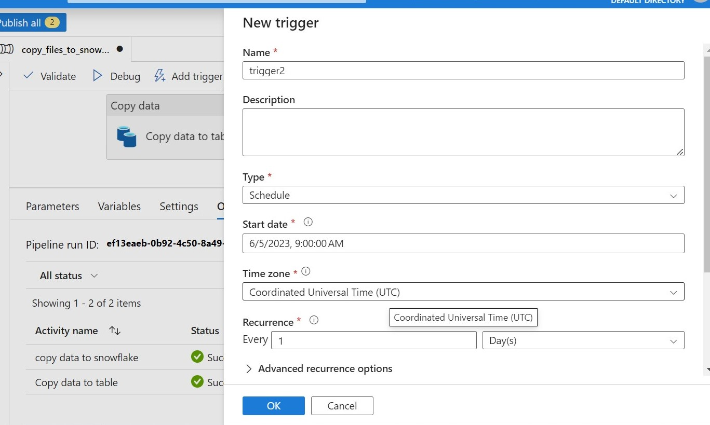

# Azure_set_up

The project shows the step to step to set up Azure and connect Azure to SSMS(SQL Server Management Studio) and shows the basic activity like copying data from SSMS to Snowflake using Azure data factory.

## overview
- create resource group
- create sql database
- create storage account
- connnect to ssms
- create a data factory
- add link service
- create pipeline and copy data from ssms to snowflake

## flow chart

### create resource group
   A resource group is a container that holds related resources for an Azure solution. A resource group is a logical grouping of models that manages access to and provides security for the models within it. When you create a resource group, it is assigned to the root resource group. You assign roles that grant specific privileges to a user within a resource group, and not to a model directly.
   create a resource group (if it does not exist)
 
  
  fill up basic information
 
  
  if it has been created successfully, it shows in the notification
 
    
### create sql database
  when we are trying to create SQL database, we need to create SQL database server if it is not exist
  create SQL database server
  
  There is no Azure AD admin, so we should search "aad" to the default directory, and we can click user on the left of the page to create a user.
  
  The page shows the user we created successfully. We can copy the user_name.
 
  Then we can choose the user as Azure AD admin and create a database server.
 
  
### create storage account
  
  
### connnect to ssms
We should download ssms first, and open the application.
Copy the server name from the database server we created before.
Copy server name from database server we created before.
If you fail to connect SQL server, go to the SQL server you created and click 'network' under security on the left of the page and add the client IP address.
  
Then you can connect the database to ssms
  
Click 'new Query' on the top bar and type the code to create a simple table
  
  
 ### create a data factory
 create a data factory
  
  
manage identities to make true we have a role to contribute to SQL server.
add Azure role assignments
  
  
Then we launch the studio.
  
 ### add link service
  link SQL database
 
 
 set up link service
 
 
 add a user to ssms
  
  
  add link service to snowflake
  

  add link service to the storage account 
  
  
  To get the URL, we need to add containers
  
   and give the permission
  
  add role assignment for the account storage
    
    
  
  Copying the URL to the storage account to add the link service, then a new link service has been added.
  
  ### copy data from ssms to snowflake
create a pipeline, name it, and use the 'copy data' activity in factory resources
  
create source dataset
  
create sink dataset
  
enable staging and compression so that it can be published and saved
  
 
add a trigger to schedule a certain time to run the procedure
   
 
