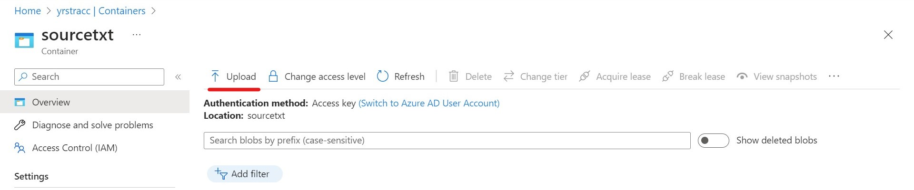
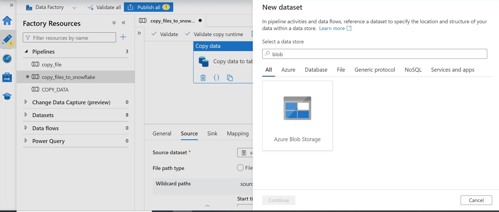
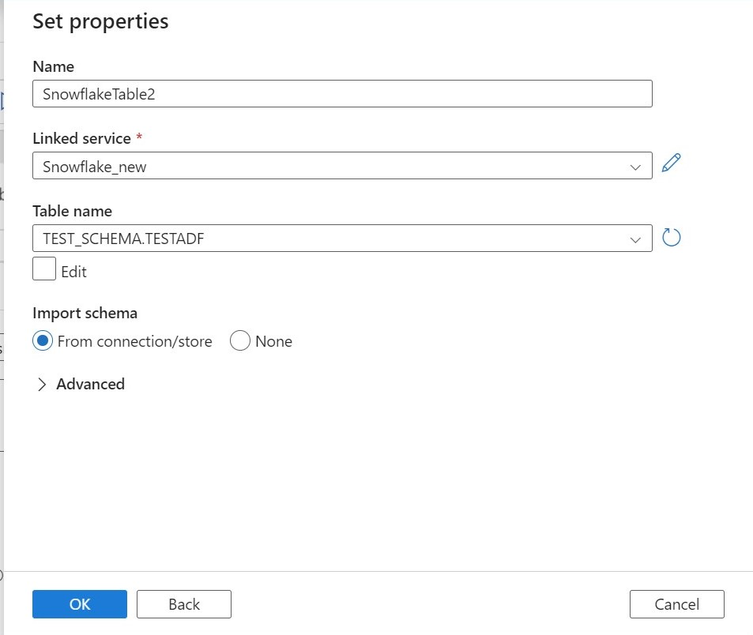

# DE_Data_Migration_Azure

The project shows the step to step to set up Azure and connect Azure to SSMS(SQL Server Management Studio) and shows the basic activity like copying data from SSMS to Snowflake using Azure data factory studio and dynamic Loading Multiple CSV Files to Azure SQL Table and snowflake. 

## overview
- create resource group
- create sql database
- create storage account
- connnect to SSMS
- create a data factory
- add link service
- create pipeline and copy data from ssms to snowflake

## flow chart

### create resource group
   A resource group is a container that holds related resources for an Azure solution. A resource group is a logical grouping of models that manages access to and provides security for the models within it. When you create a resource group, it is assigned to the root resource group. You assign roles that grant specific privileges to a user within a resource group, and not to a model directly.
   create a resource group (if it does not exist)
 
  
  fill up basic information
 
  
  if it has been created successfully, it shows in the notification
 
    
### create sql database
  when we are trying to create SQL database, we need to create SQL database server if it is not exist
  create SQL database server
  
  There is no Azure AD admin, so we should search "aad" to the default directory, and we can click user on the left of the page to create a user.
  
  The page shows the user we created successfully. We can copy the user_name.
 
  Then we can choose the user as Azure AD admin and create a database server.
 
  After that, we can create database and named it under the database server we created.
  
### create storage account
  
  
### connnect to SSMS
We should download ssms first, and open the application.
Copy the server name from the database server we created before.
Copy server name from database server we created before.
If you fail to connect SQL server, go to the SQL server you created and click 'network' under security on the left of the page and add the client IP address.
  
Then you can connect the database to ssms
  
Choose the database you created and click 'new Query' on the top bar and type the code to create a table on SSMS
  
  
 ### create a data factory
 create a data factory
  
  
manage identities to make true we have a role to contribute to SQL server.
add Azure role assignments
  
  
Then we launch the studio.
  
 ### add link service
  link SQL database
 
 
 set up link service
 
 
 add a user to ssms
  
  
  add link service to snowflake
  

  add link service to the storage account 
  
  
  To get the URL, we need to add containers
  
   and give the permission
  
  add role assignment for the account storage
    
    
  
  Copying the URL to the storage account to add the link service, then a new link service has been added.
  
  ### copy data from ssms to snowflake
create a pipeline, name it, and use the 'copy data' activity in factory resources
  
create source dataset
  
create sink dataset
  
enable staging and compression so that it can be published and saved
  
 
add a trigger to schedule a certain time to run the procedure
   
  
  
  ## dynamic Loading Multiple CSV Files to Azure SQL Table and snowflake
 
 ##  ## Create container to upload files
 Open the storage account we created before, and choose a container to create a new container to upload files from local machine
   
 Choose the container and click Upload bottom to upload CSV files.
   
  Drag and drop files to upload multiple files.
  
 ### copy files to SSMS table
 create table under database you created on SSMS. launch data factory and use copy data activity.
 create source dataset and choose CSV files.
  
 Set properties like the below and leave the directory and filename blank:
 
 Choose the wildcard file path and choose all CSV files
  
 Create a target dataset of azure SQLdatabase and choose the table you created on SSMS
  
 
 ### copy table to snowflake
 Use copy data activity to copy the SSMS table to Snowflake.
 Choose SQL database table as the source dataset and create the target dataset
  
 Enable staging and compression
  
 Debug the activities to find if they worked
  

 ### Add a trigger to update automatically
add trigger so that it can update the database automatically
  
publish all changes and save it.

# lesson learned
There will meet some problems when we try to set up Azure. For example, when we try to connect SSMS using Azure Active Directory - universal with MFA, it may not work sometimes. So, when we set up the SQL database server, it is necessary to add both SQL and Azure AD authentication. 
Apart from that, when I try to link the SQL database to the Azure data factory, it may be denied by the firewall. Therefore, adding your client IP to the SQL database server before linking could solve the problem. 
Additionally, we should link the blob storage account and enable staging to publish successfully, because we use SQL database as source data to direct copy data to Snowflake. Otherwise, it cannot be published. Lastly, we can create a container at blob storage and use it to upload multiple files to the Azure database and link to other platforms like Snowflake.
